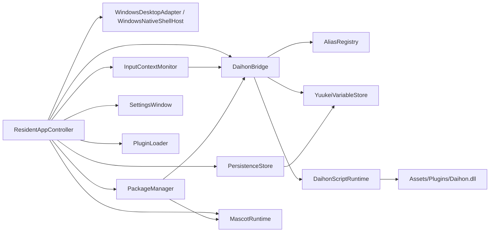

# Yuukei プロジェクト実装調査レポート

作成日: 2026-03-10

## 対象と読み方

このレポートは、以下を主対象として作成した。

- `docs/yuukei_spec/` の全仕様書
- `docs/daihon_spec/` の全仕様書
- `examples/` のサンプル `.daihon` とデフォルトパッケージ
- `Daihon/` 配下の同梱 Daihon ソース
- `Yuukei/Assets/Scripts/Runtime/` の全 C# 実装
- `Yuukei/Assets/Editor/`、`Yuukei/Assets/Tests/`、`Validation/`、`Yuukei/Assets/Scenes/SampleScene.unity`
- `Yuukei/Packages/manifest.json`、`packages-lock.json`、主要 `.csproj`

注意:

- `Yuukei/Packages/com.vrmc.*` や `Library/PackageCache` は主に外部依存であり、Yuukei 固有実装の中心ではないため、全量精読ではなく「どう組み込まれているか」と「ビルドに与える影響」を中心に確認した。
- したがって、このレポートは「Yuukei という製品実装が今どこまでできているか」を判断するための監査レポートであり、同梱されている外部ライブラリそのもののレビューではない。

## 結論

このリポジトリが目指しているのは、**Windows 向けの Unity 製デスクトップマスコット常駐アプリの MVP** であり、仕様上の中心は次の 4 点にある。

1. 透明ウィンドウ上に住み着くマスコット体験
2. Daihon スクリプトによるイベント駆動の振る舞い
3. パッケージ切替と永続化
4. システムトレイ、ショートカット、設定ウィンドウによる管理

現状は、**「MVP の骨格はかなりできているが、内容の埋まり方はまだ uneven」** という状態にある。

特に実装が進んでいるのは次の領域。

- 常駐ランタイムの起動と統合制御
- 透明ウィンドウ化、トレイメニュー、ショートカット登録
- VRM ロードと簡易マスコット移動
- DaihonBridge のイベント配送、alias 解決、`show_choices` を含む標準関数公開
- `save.json` / パッケージ manifest の読み書き
- 設定 UI 骨格

一方で、仕様との差分や未達が目立つのは次の領域。

- 「特定アプリ使用中ディスプレイ回避」は未実装
- package `assets` / 小物の実ロードは未実装に近い
- 個別 override の UI と実運用導線が未整備
- デフォルトパッケージの中身自体に壊れた参照がある
- 同梱 `.daihon` の一部が現在の組み込み関数群と噛み合っていない
- DLL 承認後の即時ロード導線が未完成
- PlayMode テストの配置が壊れている

要するに、**「起動して動くプロトタイプ」から「仕様準拠の Windows MVP」に上げる直前の段階** で、コアの配線は済んでいるが、コンテンツ整合と最後の 20〜30% が残っている。

## 仕様上の完成像

仕様書群から読み取れる Yuukei の完成像は、単なる会話 UI ではなく、以下を実現する「居住型キャラクターランタイム」である。

- Windows 上で常駐起動する
- 透明ウィンドウ上にキャラクターを表示する
- マルチモニタ空間をふわふわ移動する
- フルスクリーン中や邪魔になる状況では露出を抑える
- クリック、ダブルクリック、ドラッグ、ファイル D&D、放置、定期発火を Daihon に渡す
- 振る舞いは主に Daihon 側で定義する
- VRM / 台本 / モーション / テクスチャ / 小物 / DLL をパッケージ単位で切り替える
- 設定画面は存在するが主役ではない
- API キーや DLL は明示的に危険性を説明する

つまり「Unity 製の AI アプリ」ではなく、**Unity が実行基盤、Daihon が振る舞い記述、パッケージが世界観単位** という構図である。

## リポジトリ構造の意味

### 1. 仕様

- `docs/yuukei_spec/`
  - 製品仕様の正本
  - 実装責務、MVP 条件、保存仕様、UI 仕様、Daihon 契約がここで定義されている
- `docs/daihon_spec/`
  - Daihon 言語仕様の正本
  - 字句、構文、条件式、関数呼び出し、制御構文の意味を定義

### 2. サンプル

- `examples/*.daihon`
  - 言語サンプル
- `examples/yuukei_default_package/`
  - 初回起動用スターターパッケージのソース

### 3. Unity 本体

- `Yuukei/`
  - 実際の Unity プロジェクト
- `Yuukei/Assets/Scripts/Runtime/`
  - Yuukei 固有ランタイムの本体
- `Yuukei/Assets/Plugins/Daihon.dll`
  - Daihon 実行系の実コンパイル成果物

### 4. Daihon ソース

- `Daihon/src/`、`Daihon/Unity/`
  - Daihon のソースや旧 Unity 統合コード
  - ただし現行の Unity 実行経路では直接コンパイル対象になっていない
  - 現行実装は `Assets/Plugins/Daihon.dll` を参照している

### 5. テスト

- `Yuukei/Assets/Tests/EditMode/`
  - 実際に Unity プロジェクトへ入っている EditMode テスト
- `Validation/`
  - 検証用の別置きテスト
  - PlayMode テストはこちらにあるが、Unity プロジェクトの `Assets/Tests/PlayMode` には存在しない

## 実装アーキテクチャ

現状の実装は、仕様書の責務分離にかなり忠実で、次の構成になっている。

この構造からわかるのは、プロジェクトがかなり明確に次を狙っていることだ。

- `ResidentAppController` を全体オーケストレータにする
- `MascotRuntime` は見た目と移動に集中させる
- `DaihonBridge` はスクリプト契約の窓口にする
- `PackageManager` と `PersistenceStore` を独立させる
- Windows 依存は `WindowsDesktopAdapter` / `WindowsShellHost` に寄せる

これは仕様の意図と整合しており、設計方針自体はかなり良い。

## 主要コンポーネントごとの実装状況

### ResidentAppController

役割:

- 起動シーケンス
- 各サブシステムの組み立て
- 設定表示 / 非表示
- 一時無効化 / 一時非表示 / 終了
- パッケージ適用

現状:

- 実装済み
- `Awake` でカメラ、`UniWindowController`、Canvas、マスコット、吹き出し、選択肢 UI、設定 UI を生成
- `Start` で非同期初期化
- Windows アダプタ、保存、パッケージ、DaihonBridge を接続
- 初回起動時には簡易スプラッシュを表示
- `app_started` を Daihon へ通知

評価:

- **骨格は完成度が高い**
- MVP の起動導線はほぼここで成立している
- 仕様どおり「キャラ本体クリックで設定を開かない」構成も守れている

### WindowsDesktopAdapter / WindowsShellHost

役割:

- ディスプレイ列挙
- フルスクリーン検知
- グローバルアイドル秒取得
- システムトレイ
- グローバルホットキー
- 秘密情報保存

現状:

- `WindowsDesktopAdapter` は `IDesktopPlatformAdapter` 実装としてかなり整っている
- Windows ビルドでは `WindowsNativeShellHost` を使い、ネイティブの隠しウィンドウ、トレイアイコン、コンテキストメニュー、`RegisterHotKey` を利用する
- エディタではネイティブホストを使わず、フォーカス中ショートカットへフォールバックする
- API キー等は `Application.persistentDataPath/secure` 配下へ保存し、Windows では DPAPI (`CryptProtectData`) で保護する

評価:

- **Windows MVP の常駐シェル部分はかなり進んでいる**
- 仕様上の「トレイ」「ショートカット」「透明ウィンドウ運用」は実装済みと言ってよい
- ただし secure storage は Windows Credential Manager ではなく、DPAPI 付きファイル保存である

### MascotRuntime

役割:

- VRM ロード
- マスコット表示
- ふわふわ移動
- 忙しさ反映
- 表情 / モーション / 小物切替

現状:

- VRM が見つからなければカプセルのプレースホルダーマスコットにフォールバック
- VRM があれば `Vrm10.LoadPathAsync` でロード
- モーションは VRMA/GLB を `VrmAnimationImporter` で読み込み、`Vrm10AnimationInstance` として再生
- 表情は VRM expression clip と組み込み alias をカタログ化して適用
- 小物は現状ハードコードされた `halo` のみ
- 移動は仮想デスクトップ座標上でランダムターゲットを選ぶ
- `busyScore` に応じて移動速度と到達距離を抑制
- 表示可能ディスプレイ集合から外れたら非表示化

評価:

- **表示・移動の基礎は実装済み**
- **VRM / 表情 / モーションの接続も一応ある**
- ただし小物システムは仕様の「package assets を読み込む」段階には到達していない

### InputContextMonitor

役割:

- クリック / ダブルクリック / ドラッグ
- 放置
- 定期発火
- ファイル D&D
- busy 判定
- フルスクリーン回避対象の計算

現状:

- 左クリック、ダブルクリック、ドラッグ開始/終了を検出して canonical event を出す
- `UniWindowController.OnDropFiles` からファイルドロップを受ける
- 45 秒で `idle_reached`
- 30 秒ごとに `periodic_tick`
- `_event_*` コンテキストを仕様に沿って構築
- フルスクリーン中の前景ウィンドウが乗っているディスプレイを allowed display から外す

評価:

- **MVP 必須イベント群はほぼ通っている**
- ただし busy 判定は「入力頻度」ではなく「最後の入力からの経過秒」で近似している
- 仕様にある「特定アプリ使用中ディスプレイ回避」は未実装

### DaihonBridge

役割:

- alias 解決
- 複数 Daihon ロード
- イベント配送
- FIFO キュー
- `periodic_tick` の coalescing
- 実行キャンセル

現状:

- `AliasRegistry` を通じて event / function の alias を canonical に解決
- package alias は built-in alias を上書き可能
- 複数 `.daihon` を順序つきでロード
- 壊れたファイルは個別にスキップ
- 実行は 1 イベントずつ
- 実行中に別イベントが来たらキューへ
- `periodic_tick` は 1 件に集約
- 一時無効化や package switch 時は実行とキューをキャンセル

評価:

- **このプロジェクトの一番できている部分の一つ**
- Yuukei 仕様で重要な alias / event queue / cancellation がきちんと意識されている

### DaihonFunctionDispatcher

役割:

- Daihon から呼べる標準関数の実装

現状の組み込み関数:

- `show_dialog`
- `set_expression`
- `play_motion`
- `set_prop_visible`
- `show_choices`
- `set_persistent`

評価:

- Yuukei 仕様で必須の標準関数は揃っている
- `show_choices` は awaitable で戻り値あり
- ただし、同梱サンプルが使っている `笑顔`、`落ち込んだ顔`、`もぐもぐ動作`、`w2` のような関数は未実装

### DaihonScriptRuntime

役割:

- Daihon テキストの parse
- scene metadata 抽出
- condition 評価
- scene 実行
- jump / scene end / event end の制御

現状:

- `DaihonLexer` / `DaihonParser` / `DaihonScriptVisitor` を使って parse
- defaults block, precondition block, scene 条件、default scene を扱う
- jump 回数上限 1000 を実装
- event scene / condition scene / default scene の実行分岐あり

評価:

- Daihon 言語仕様に寄せた実行系になっている
- ただしこの層の本体は `Assets/Plugins/Daihon.dll` 依存であり、`Daihon/` フォルダのソースは現行 Unity 実装とは分離している

### PackageManager

役割:

- パッケージ導入
- active package 切替
- manifest 読み込み
- override 解決
- 壊れた要素の警告

現状:

- 保存先形式は仕様どおり `persistentDataPath/package/{creator}-{version}-{guid}`
- 初回起動時に example スターターパッケージを persistent 領域へコピー
- `manifest.json` を解析し、Daihon / VRM / texture / motion / dll の選択結果を解決
- package switch で overrides をリセット
- `ValidateActivePackage()` は missing daihon / character / textures / motions / dll を警告

評価:

- **パッケージ基盤はかなりできている**
- ただし `assets` は実質未使用
- broken asset の個別検証も入っていない

### PersistenceStore

役割:

- `save.json` 読み書き
- persistent variable 管理
- app state 保存

現状:

- `save.json` 形式は仕様に近い
- unsupported type は読み飛ばし
- persistent variable の型変更を拒否
- 非同期 save queue と即時 save の両方を持つ
- character position や transient state は保存しない

評価:

- **堅実にできている**
- 仕様との整合も高い

### SettingsWindow

役割:

- サイドバー型の設定 UI

現状:

- UI Toolkit で単一ウィンドウ+サイドバーを生成
- ページ:
  - 外見と振る舞い
  - パッケージ
  - マーケットプレイス
  - 連携
  - 動作設定
  - About
- package switch / delete / import
- DLL 警告表示
- API key 保存 / 削除
- 一時無効化 / 一時非表示 toggle
- shortcut 設定入力

評価:

- **骨格としては仕様を満たす**
- ただし appearance ページは「状態表示」が中心で、override を編集する具体的 UI はまだない

### PluginLoader

役割:

- DLL 候補の列挙
- 明示承認
- ロード

現状:

- package の `dlls` を scan
- 自動ロードはしない
- 承認フラグを持つ
- `Assembly.LoadFrom` でロードする実装がある

評価:

- 方針は仕様に沿う
- しかしフローは未完成
  - 承認ボタンを押してもその場で `ActivateApprovedPlugins()` は呼ばれない
  - package switch 後にも承認済み DLL を自動起動しない
- つまり「警告付きロード導線」はあるが、「明示確認後ロード」は中途半端

## 仕様適合の到達度

### ほぼ達成している

- Windows 常駐アプリのランタイム骨格
- 透明ウィンドウとキャラクター表示
- システムトレイ導線
- グローバルショートカット登録
- クリック / ダブルクリック / ドラッグ / ファイル D&D / 放置 / 定期発火の Daihon 連携
- alias 解決
- `show_choices` の待機と戻り値
- パッケージ切替
- `save.json` ベースの復元
- 設定画面骨格
- 吹き出し 1 つ制御

### 部分達成

- busy 状態反映
  - あるが単純化されている
- フルスクリーン回避
  - ある
- package content の個別差し替え
  - データモデルと resolver はあるが UI 導線不足
- VRM expression / motion 連携
  - あるがコンテンツ側との噛み合わせが弱い
- DLL 警告付きロード
  - UI と候補検出はあるがロード完了までの流れが甘い
- 初回起動チュートリアル
  - starter package 導入はあるが「Daihon ベースの物語的チュートリアル」までは未完成

### 未達

- 特定アプリ使用中ディスプレイ回避
- package `assets` の本格利用
- 小物の package 駆動ロード
- override のユーザー操作 UI
- PlayMode テストの正常統合

## 実際に確認した不整合・壊れポイント

### 1. デフォルトパッケージ manifest が存在しない Daihon を参照している

`examples/yuukei_default_package/manifest.json` は次を参照している。

- `daihon/main.daihon`
- `daihon/ティータイムの約束.daihon`
- `daihon/ヤンデレ.daihon`

しかし実ファイルとして存在するのは次の 2 つだけ。

- `main.daihon`
- `ティータイムの約束.daihon`

`ヤンデレ.daihon` は存在しない。

影響:

- 初回導入されるスターターパッケージが最初から warning を出す
- 仕様上は「壊れた要素だけスキップ」で正しいが、デフォルトパッケージとしては品質が低い

### 2. 同梱 Daihon が現在の標準関数セットと噛み合っていない

例:

- `ティータイムの約束.daihon` は `＜笑顔＞`、`＜もぐもぐ動作＞`、`＜落ち込んだ顔＞` を使う
- しかし Yuukei の標準関数登録は `show_dialog`, `set_expression`, `play_motion`, `set_prop_visible`, `show_choices`, `set_persistent` のみ

影響:

- クリック条件によっては同梱スクリプトが runtime error を起こす
- `DaihonBridge` はスクリプト単位で例外を catch して継続するためアプリ全体は止まりにくいが、体験は壊れる

### 3. package `assets` は manifest で解決されるが実利用されていない

`PackageManager` は `AssetPaths` を組み立てるが、`ResidentAppController` / `MascotRuntime` 側でそれをロード・配置していない。

影響:

- 仕様上の「小物」「assets」拡張はほぼ未着手
- `set_prop_visible` も現状はハードコード `halo` の ON/OFF に留まる

### 4. DLL 承認後に即時ロードされない

`PluginLoader` 自体には `ActivateApprovedPlugins()` があるが、

- 初期化時の最後に 1 回呼ばれるだけ
- 設定 UI の「DLL を承認」は approval フラグを立てるだけ
- package switch 後にも呼ばれない

影響:

- 「明示承認したら使える」ではなく、「承認だけして次の再初期化待ち」になっている

### 5. PlayMode テストが Unity プロジェクト本体に置かれていない

確認結果:

- `Yuukei.PlayModeTests.csproj` は `Assets/Tests/PlayMode/BootstrapPlayModeTests.cs` と `ChoiceOverlayControllerTests.cs` を要求する
- 実ファイルは `Validation/YuukeiTests/PlayMode/` にしかない
- `dotnet build Yuukei\Yuukei.PlayModeTests.csproj` は失敗した

影響:

- PlayMode テストは現状の Unity プロジェクト構成では壊れている
- 検証基盤が途中で止まっている証拠のひとつ

## テスト・ビルド観点の確認結果

実行した確認:

1. `dotnet build Yuukei\Yuukei.slnx -nologo`
2. `dotnet build Yuukei\Yuukei.EditModeTests.csproj -nologo`
3. `dotnet build Yuukei\Yuukei.PlayModeTests.csproj -nologo`

結果:

- `Yuukei.slnx` はビルド成功
  - 0 エラー
  - 多くの warning は主に VRM / UniGLTF 由来
  - Yuukei 固有コード側では nullable 注釈 warning が少数
- `Yuukei.EditModeTests.csproj` はビルド成功
- `Yuukei.PlayModeTests.csproj` は失敗
  - 理由: `Assets/Tests/PlayMode/*.cs` が存在しない

補足:

- `dotnet test` では Unity Test Framework のテスト一覧や実行結果をこの環境で正常取得できなかった
- したがって、**ビルド確認はできたが、Unity Test Runner 実行までは確認していない**

## 現在の完成度をどう見るべきか

### 実装の成熟度

- 常駐シェル: 高い
- Daihon bridge: 高い
- 保存 / package 基盤: 中〜高
- マスコット表現: 中
- 設定 UI: 中
- package content 実体化: 低〜中
- コンテンツ整合: 低〜中
- 自動検証基盤: 中未満

### 製品としての段階感

現在の Yuukei は、

- **「システムとしての骨格」はだいぶできている**
- **「スターターパッケージを含む実際の体験」はまだ荒い**

という段階にある。

言い換えると、

- エンジン側は組み上がってきている
- コンテンツと最後の仕様詰めが追いついていない

という状態である。

## 先に見るべきファイル

全体像を最短で掴むなら、次の順で読むのがよい。

1. `docs/yuukei_spec/05_Daihon実行契約.md`
2. `Yuukei/Assets/Scripts/Runtime/ResidentAppController.cs`
3. `Yuukei/Assets/Scripts/Runtime/DaihonBridge.cs`
4. `Yuukei/Assets/Scripts/Runtime/MascotRuntime.cs`
5. `Yuukei/Assets/Scripts/Runtime/PackageManager.cs`
6. `Yuukei/Assets/Scripts/Runtime/SettingsWindow.cs`
7. `examples/yuukei_default_package/manifest.json`

## 最終評価

このプロジェクトは、**Yuukei の Windows MVP を本気で成立させようとしている実装**であり、単なるアイデア置き場ではない。

特に良い点は次の通り。

- 仕様駆動で責務分離している
- Daihon 契約を中心に据えている
- Windows 固有処理を adapter / host に寄せている
- package / persistence / runtime / UI を分けている

一方で、まだ完成していないことも明確で、詰めるべきは次の領域だ。

- package content の実体化
- サンプル package / sample daihon の整合修正
- blocked-app 回避
- DLL 承認から有効化までの実処理
- PlayMode テストの復旧

総合すると、**「設計の方向は合っており、MVP の中核は実装済み。ただし、今はまだ “仕様どおりに安心して触れる完成版” ではなく、“動く骨格と一部体験がある開発中 MVP”」** という評価になる。
